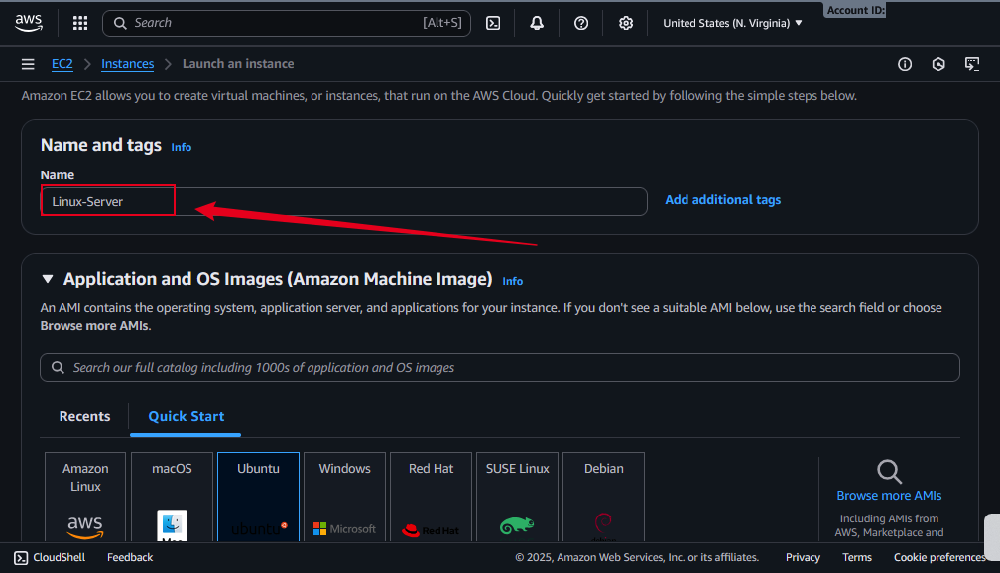
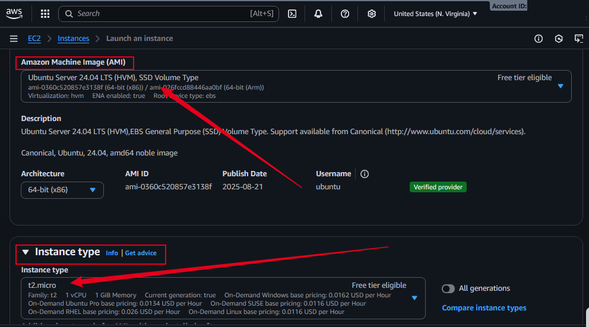
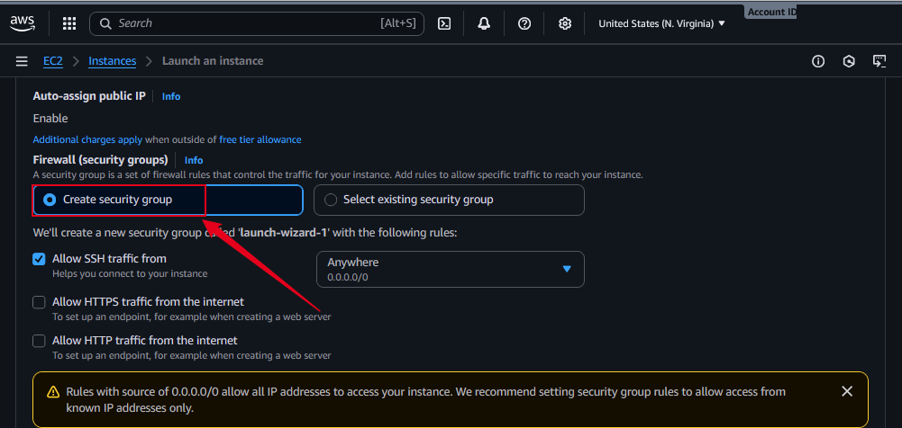
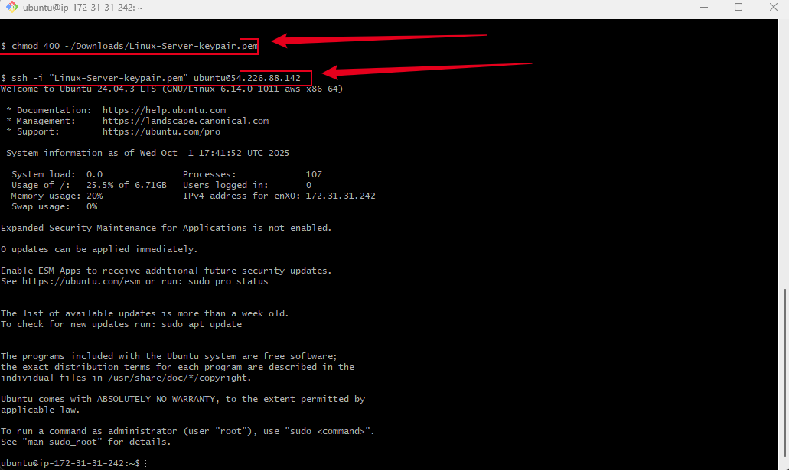

# **Mini-Project: Introduction to Linux**

## **Project Overview**

This project provides a strong foundation in Linux for beginners aspiring to build a career in DevOps, Cloud Computing, Software Development, Cybersecurity, AI, Data Science, or QA Testing. It covers the installation, setup, and usage of Linux in a cloud environment (AWS EC2), package management, and fundamental commands to help learners become confident in managing Linux systems.

## **Why is this Project Relevant?**

Linux powers most servers, cloud infrastructures, and enterprise systems worldwide. Mastering Linux is an essential skill for IT professionals because:

- It is widely used in DevOps pipelines and cloud platforms.
- Provides stability, scalability, and security for enterprise applications.
- Forms the foundation for advanced concepts like containerization, orchestration, and automation.
- Hands-on Linux skills are a requirement for many technical job roles.

## **Project Goals and Objectives**

- Learn the basics of Linux and its distributions.
- Provision and access a Linux server in the cloud using AWS EC2.
- Understand secure communication with servers using SSH.
- Practice package management (installing, updating, and removing software).
- Build confidence in using essential Linux commands.

## **Prerequisites**

- A laptop/desktop with Windows or macOS.
- Basic knowledge of using a terminal or command line.
- An active AWS Free Tier account.
- AWS EC2 key pair (`.pem` file) for SSH connection.
- Internet connection to access cloud resources.

## **Project Deliverables**

- A properly set up project directory with organized files.
- Screenshots of Linux server setup and SSH connection.
- Documentation (`README.md`) containing step-by-step project instructions.
- Hands-on practice with Linux commands and package managers.

## **Tools & Technologies Used**

- **Operating System**: Linux (Ubuntu Distribution on AWS EC2)
- **Cloud Platform**: Amazon Web Services (AWS)
- **Secure Protocol**: SSH (Secure Shell)
- **Client Tools**:

  - Windows: MobaXterm / Git Bash / PuTTY
  - macOS: Terminal (default)

- **Package Managers**: `apt` (Ubuntu/Debian), `yum` / `dnf` (RedHat/CentOS/Fedora)

## **Project Components**

1. Linux distributions overview.
2. Setting up an AWS EC2 Linux server.
3. Connecting securely via SSH.
4. Installing, updating, and removing software packages.
5. Hands-on practice with basic Linux commands.
6. Documentation and screenshots for each step.

## **Task 1: Project Setup and Directory Structure**

### **Objective**

Set up the root project directory with all required sub-directories and files for the _Mini-Project: Introduction to Linux_.

### **Steps**

1. **Create the Root Project Directory**

```bash
mkdir 01-Mini-Introduction-to-Linux
cd 01-Mini-Introduction-to-Linux
```

2. **Create Sub-Directory for Images**

```bash
mkdir images
```

- `images/` → To store screenshots of setup, SSH connection, and outputs.

3. **Create Essential Files**

```bash
touch README.md .gitignore
```

- `README.md` → Main project documentation.
- `.gitignore` → To exclude unnecessary files (e.g., `.pem` keys, system files).

✅ **Task 1 Completed:** The project directory has been created with only the essential components needed to begin documentation and development.

## **Task 2: AWS Account Setup and Provisioning Ubuntu Server**

### **Objective**

Create and configure an AWS account, then launch an Ubuntu EC2 instance that will serve as the Linux server for this project.

### **Steps**

#### 1. **Register an AWS Account**

- Go to [AWS Registration Page](https://aws.amazon.com/free).
- Click **Create an AWS Account** and complete the registration process.
- Select **Free Tier Plan** (to avoid unnecessary billing).
- Provide billing details (a debit/credit card is required, but free tier limits prevent charges).
- Verify your identity via SMS/phone call.

#### 2. **Sign in to the AWS Management Console**

- Navigate to [AWS Console](https://console.aws.amazon.com/).
- Use your **root user credentials** to log in.

#### 3. **Navigate to EC2 Service**

- In the search bar, type **EC2**.
- Click **EC2 (Elastic Compute Cloud)**.
- On the left-hand panel, select **Instances**.

#### 4. **Launch an Ubuntu EC2 Instance**

- Click **Launch Instance**.
- Fill in the required details:

  - **Name**: `Linux-Server`
  - **AMI (Amazon Machine Image)**: Choose **Ubuntu Server 22.04 LTS (Free Tier eligible)**.
  - **Instance Type**: Select **t2.micro (Free Tier eligible)**.
  - **Key Pair (login)**:

    - Create a new key pair named `Linux-Server-keypair`.
    - Download the `.pem` file and keep it safe. _(This will be used for SSH connection later)_

  - **Network Settings**:

    - Allow **SSH (port 22)** from **My IP**.

  - **Storage**: Default (8 GB) is sufficient.

- Click **Launch Instance**.

#### 5. **Verify the Instance**

- Navigate to **Instances → Running Instances**.
- Ensure the instance state shows **Running**.
- Copy the **Public IPv4 Address** (this will be used for SSH connection).

### **Final Deliverables**

- AWS account successfully created.
- Ubuntu EC2 instance (`t2.micro`) launched and running.
- `.pem` private key securely stored on local machine.
- Public IP address of the instance noted for SSH connection.

### Screenshots:

**Screenshot 1:** Name and Tags


**Screenshot 2:** AMI and Instance Type


**Screenshot 3:** Keypair and Network Setting


**Screenshot 4:** Create Security Group


**Screenshot 5:** EC2 Instance


✅ **Task 2 Completed:** AWS account has been set up and an Ubuntu server (EC2 instance) is provisioned successfully.

## **Task 3: Connecting to the Ubuntu EC2 Server via SSH**

### **Objective**

Securely connect from your local machine (Windows/macOS) to the Ubuntu EC2 instance using **SSH (Secure Shell)** and the `.pem` key downloaded in Task 2.

### **Steps**

#### 1. **Locate the `.pem` Key**

- After launching your EC2 instance in Task 2, you downloaded a private key file (e.g., `Linux-Server-keypair.pem`).
- Move the `.pem` key to a safe location on your local machine (commonly in the **Downloads** folder).

#### 2. **Set File Permissions (Linux/macOS Users Only)**

To ensure the key is secure, run:

```bash
chmod 400 ~/Downloads/Linux-Server-keypair.pem
```

This restricts access so only the file owner can read it.

#### 3. **Open a Terminal or SSH Client**

- **Windows users**: Use **MobaXterm** (recommended) or **Git Bash**.
- **macOS users**: Use the built-in **Terminal** app.

#### 4. **Navigate to Key Directory**

Move into the folder where the `.pem` file is located (assuming it’s in `Downloads`):

```bash
cd ~/Downloads
ls -l
```

You should see your key file listed (e.g., `Linux-Server-keypair.pem`).

#### 5. **Retrieve Public IP Address of EC2**

- Go to **AWS Console → EC2 → Instances**.
- Copy the **Public IPv4 address** of your running Ubuntu server.
  Example: `54.226.88.142`

#### 6. **Connect to the Instance Using SSH**

Run the following command:

```bash
ssh -i "Linux-Server-keypair.pem" ubuntu@54.226.88.142
```

- `ssh` → Command to open a secure shell connection.
- `-i` → Specifies the private key file.
- `ubuntu` → Default username for Ubuntu EC2 instances.
- `<PUBLIC_IP_ADDRESS>` → Replace with your server’s IP.

#### 7. **Successful Connection Output**

If the connection is successful, you should see:

```bash
Welcome to Ubuntu 22.04 LTS (GNU/Linux 5.15.0-1019-aws x86_64)
```

And your terminal prompt should change to something like:

```bash
ubuntu@ip-172-31-31-242:~$
```

### **Final Deliverables**

- Secure SSH connection established to the Ubuntu EC2 server.
- Screenshots of:

  - Running SSH command.
  - Successful connection (Ubuntu welcome message).

**Screenshot:** SSH Welcome


✅ **Task 3 Completed:** Successfully connected to the Ubuntu EC2 server via SSH using the private key.

## **Task 4: Linux Package Management (Installing, Updating, and Removing Software)**

### **Objective**

Learn how to manage software packages on the Ubuntu EC2 instance using **APT (Advanced Package Tool)**. This includes installing new software, updating existing packages, and removing unnecessary packages.

### **Steps**

#### 1. **Update Package Lists**

Before installing new software, refresh the package lists to ensure you get the latest version:

```bash
sudo apt update
```

- `sudo` → Run the command with administrative privileges.
- `apt update` → Fetches the latest package information from repositories.

#### 2. **Install Software Packages**

Install a useful package called `tree` to visualize directory structures:

```bash
sudo apt install tree
```

- Confirm installation if prompted by typing `y`.

**Test the installation**:

```bash
tree ~/  # Displays the folder structure of your home directory
```

#### 3. **Upgrade Installed Packages**

Keep your system up-to-date by upgrading all installed packages:

```bash
sudo apt upgrade
```

- This installs the latest versions of packages currently on your system.

#### 4. **Remove Software Packages**

To remove the `tree` package (or any software no longer needed):

```bash
sudo apt remove tree
```

- This removes the software but keeps configuration files.

For a complete removal including configuration files:

```bash
sudo apt purge tree
```

#### 5. **Practice Installing Other Tools**

Try installing other packages like `nginx` to practice package management:

```bash
sudo apt install nginx
sudo systemctl start nginx    # Start Nginx service
sudo systemctl status nginx   # Check status of Nginx
sudo systemctl stop nginx     # Stop Nginx service
sudo apt remove nginx         # Remove Nginx
```

### **Final Deliverables**

- Successfully installed, updated, and removed software packages.

  - `sudo apt update` output
  - `sudo apt install tree` and running `tree` command
  - `sudo apt upgrade` output
  - Removing `tree` or `nginx`

✅ **Task 4 Completed:** You now know how to install, update, and remove software packages on a Linux server using APT.

## **Task 5: Basic Linux Commands and File System Navigation**

### **Objective**

Learn to navigate the Linux file system, manage files and directories, and perform basic operations using terminal commands on your Ubuntu EC2 instance.

### **Steps**

#### 1. **Check Current Directory**

To see where you are in the file system:

```bash
pwd
```

- `pwd` → Prints the **working directory** (current location in the file system).

#### 2. **List Files and Directories**

```bash
ls
ls -l       # List with detailed info
ls -a       # Include hidden files
ls -lh      # Human-readable sizes
```

- `ls` → Lists files and directories in the current location.

#### 3. **Change Directory**

```bash
cd /path/to/directory
cd ..       # Move up one directory
cd ~        # Go to home directory
```

- `cd` → Change current directory.

#### 4. **Create Directories and Files**

```bash
mkdir myfolder           # Create a new directory
touch myfile.txt         # Create a new empty file
```

- `mkdir` → Make new directory
- `touch` → Create empty file

#### 5. **View and Edit Files**

```bash
cat myfile.txt           # Display file content
nano myfile.txt          # Open file for editing in terminal
```

- `cat` → View file content
- `nano` → Edit files in terminal

#### 6. **Move, Copy, and Remove Files/Directories**

```bash
cp myfile.txt copyfile.txt      # Copy file
mv myfile.txt newfolder/        # Move file
rm myfile.txt                   # Remove file
rm -r myfolder/                 # Remove directory recursively
```

- `cp` → Copy file
- `mv` → Move or rename file/directory
- `rm` → Delete file or folder (`-r` for directories)

#### 7. **Check Disk Usage**

```bash
df -h       # Show disk space usage
du -sh *    # Show folder sizes in current directory
```

- `df -h` → Disk free space in human-readable format
- `du -sh *` → Disk usage per folder

#### 8. **Search Files**

```bash
find . -name "myfile.txt"
grep "search_text" myfile.txt
```

- `find` → Search for files in directories
- `grep` → Search for text within files

### **Final Deliverables**

- Successfully navigated directories and files.
- Created, edited, moved, copied, and removed files/directories.

  - Listing files and directories
  - Creating/editing files
  - Moving/removing files
  - Disk usage commands

✅ **Task 5 Completed:** You now have a foundational understanding of Linux commands, file system navigation, and basic file management on your Ubuntu server.

## **Task 6: Managing Permissions, Users, and Groups**

### **Objective**

Learn how to manage file permissions, create users, and organize users into groups on your Ubuntu EC2 instance to maintain security and proper access control.

### **Steps**

#### 1. **Check Current User**

```bash
whoami
```

- Displays the username you are currently logged in as.

#### 2. **Add a New User**

```bash
sudo adduser newuser
```

- Replace `newuser` with the desired username.
- Follow prompts to set a password and optional user information.

#### 3. **Add User to Sudo Group**

```bash
sudo usermod -aG sudo newuser
```

- Gives administrative privileges to the new user.

#### 4. **Delete a User**

```bash
sudo deluser newuser
```

- Remove the user from the system.

#### 5. **Create a Group**

```bash
sudo groupadd mygroup
```

- Creates a new group called `mygroup`.

#### 6. **Add User to a Group**

```bash
sudo usermod -aG mygroup newuser
```

- Adds `newuser` to `mygroup`.

#### 7. **Change File Ownership**

```bash
sudo chown newuser:mygroup file.txt
```

- `chown` → Change ownership of a file or directory.
- Format: `username:groupname file`

#### 8. **Change File Permissions**

```bash
chmod 755 file.txt
chmod 644 file.txt
```

- `chmod` → Change permissions for files and directories.
- Permission format: `r` (read), `w` (write), `x` (execute).
- `755` → Owner can read/write/execute, group and others can read/execute.
- `644` → Owner can read/write, group and others can only read.

#### 9. **View File Permissions**

```bash
ls -l
```

- Lists files with permission, owner, and group information.

### **Final Deliverables**

- Successfully created and deleted users and groups.
- Assigned users to groups and set proper permissions.

  - New user creation
  - Group creation
  - Changing ownership and permissions

✅ **Task 6 Completed:** You now know how to manage users, groups, and file permissions on Linux securely.

## **Task 7: Installing and Managing Nginx Web Server**

### **Objective**

Install, configure, and manage the **Nginx web server** on your Ubuntu EC2 instance to serve web content and practice basic server management.

### **Steps**

#### 1. **Update Package Lists**

Always start by updating your package lists:

```bash
sudo apt update
```

#### 2. **Install Nginx**

```bash
sudo apt install nginx
```

- Confirm installation when prompted by typing `y`.

#### 3. **Start Nginx Service**

```bash
sudo systemctl start nginx
```

- Starts the Nginx web server immediately.

#### 4. **Enable Nginx at Boot**

```bash
sudo systemctl enable nginx
```

- Ensures Nginx starts automatically after server reboot.

#### 5. **Check Nginx Status**

```bash
sudo systemctl status nginx
```

- Displays if Nginx is running and active.

#### 6. **Access Nginx Default Page**

- Open a web browser and enter your EC2 instance’s **public IP address**.
- You should see the default **“Welcome to Nginx”** page.

#### 7. **Stop or Restart Nginx**

```bash
sudo systemctl stop nginx     # Stop the server
sudo systemctl restart nginx  # Restart the server after configuration changes
```

#### 8. **Remove Nginx (Optional)**

```bash
sudo apt remove nginx
sudo apt purge nginx
```

- Removes the Nginx package (and optionally configuration files).

### **Final Deliverables**

- Nginx successfully installed and running.
- Verified access to the default Nginx web page via browser.

✅ **Task 7 Completed:** Nginx is installed and operational on your Ubuntu EC2 server, allowing you to serve web pages and manage the service.

## **Task 8: Installing and Managing Other Common Linux Tools (Git, Curl, Vim, etc.)**

### **Objective**

Install and practice using commonly used Linux tools such as **Git**, **Curl**, and **Vim** to enhance productivity on your Ubuntu server.

### **Steps**

#### 1. **Update Package Lists**

```bash
sudo apt update
```

#### 2. **Install Git**

```bash
sudo apt install git
git --version
```

- Verify installation by checking the Git version.
- Git is used for version control and managing code repositories.

#### 3. **Install Curl**

```bash
sudo apt install curl
curl --version
```

- Curl is used to transfer data to/from a server, helpful for testing APIs and downloading files.

#### 4. **Install Vim**

```bash
sudo apt install vim
vim --version
```

- Vim is a command-line text editor for editing code and configuration files.

#### 5. **Practice Using Vim**

- Open a file for editing:

```bash
vim testfile.txt
```

- Basic commands:

  - `i` → Enter insert mode to type
  - `Esc` → Exit insert mode
  - `:w` → Save changes
  - `:q` → Quit Vim
  - `:wq` → Save and quit

#### 6. **Optional: Install Other Useful Tools**

```bash
sudo apt install htop   # Monitor system resources
sudo apt install tree   # Visualize directory structure
sudo apt install net-tools # Networking commands like ifconfig
```

### **Final Deliverables**

- Successfully installed Git, Curl, Vim, and other common tools.
- Verified each tool by checking its version or running basic commands.

  - Git, Curl, Vim version outputs
  - Example of editing a file in Vim
  - Running `htop` or `tree` commands

✅ **Task 8 Completed:** Essential Linux productivity tools installed and tested on your Ubuntu server.

## **Task 9: Practice Linux Commands and Explore Tools Further**

### **Objective**

Reinforce your Linux skills by practicing commands, exploring installed tools, and performing hands-on exercises on your Ubuntu EC2 instance.

### **Steps**

#### 1. **Explore the File System**

- List files with details:

```bash
ls -la
```

- Navigate directories and check paths:

```bash
cd /var
pwd
```

#### 2. **Practice File Operations**

- Create, copy, move, and delete files/directories:

```bash
mkdir practice_folder
touch practice_folder/file1.txt
cp practice_folder/file1.txt practice_folder/file2.txt
mv practice_folder/file2.txt practice_folder/subfolder/
rm -r practice_folder/subfolder/
```

#### 3. **Use `tree` to Visualize Structure**

```bash
tree practice_folder
```

- Shows a hierarchical structure of directories and files.

#### 4. **Monitor System Resources**

- Check CPU, memory, and processes:

```bash
htop
top
```

- `htop` → Interactive view of processes and system usage.
- `top` → Standard command for real-time process monitoring.

#### 5. **Test Networking with Curl**

- Fetch data from a URL:

```bash
curl https://www.google.com
curl -I https://www.google.com  # Only headers
```

- Useful for testing server responses and APIs.

#### 6. **Practice Editing Files with Vim**

```bash
vim practice_file.txt
```

- Insert text, save, and quit using `i`, `:wq`, `:q!`.
- Explore search (`/text`), copy (`y`), and paste (`p`) in Vim.

#### 7. **Check Disk and Directory Sizes**

```bash
df -h
du -sh *
```

- Ensures understanding of disk usage and file sizes.

#### 8. **Experiment with Permissions**

- Change permissions and ownership:

```bash
chmod 700 practice_file.txt
sudo chown ubuntu:ubuntu practice_file.txt
ls -l
```

- Reinforces user/group management and security practices.

### **Final Deliverables**

- Practiced essential Linux commands for file management, navigation, and system monitoring.
- Verified tool functionality (`tree`, `htop`, `curl`, `vim`).

  - File creation, copying, moving, and removal
  - `tree` command output
  - `htop` or `top` output
  - Curl responses
  - Vim editing session

✅ **Task 9 Completed:** You have hands-on experience with Linux commands and tools, reinforcing the skills needed to manage a Linux server effectively.

## **Task 10: Wrap-up, Conclusion, and Project Submission**

### **Objective**

Finalize the _Mini-Project: Introduction to Linux_ by reviewing all tasks, documenting key learnings, and preparing the project for GitHub submission.

### **Steps**

#### 1. **Review All Completed Tasks**

- Go through Tasks 1–9 and ensure all steps are fully documented in the **README.md**.
- Confirm that screenshots for AWS setup, SSH connection, package management, Linux commands, user management, Nginx, and other tools are saved in the `images/` folder.

#### 2. **Summarize Key Learnings**

- Understanding Linux fundamentals: file system, commands, and permissions.
- Provisioning and connecting to an Ubuntu server on AWS.
- Managing software with APT (install, update, remove).
- Setting up and managing users and groups securely.
- Installing and managing Nginx web server.
- Using essential tools: Git, Vim, Curl, htop, and tree.
- Hands-on experience in a real cloud environment.

#### 3. **Document Challenges and Solutions**

- Note any issues faced during the setup or command execution.
- Document how challenges were resolved, such as:

  - Fixing SSH key permission errors.
  - Handling package installation conflicts.
  - Correcting file permission or ownership issues.

#### 4. **Clean Up the Server (Optional)**

- Remove unnecessary test files and folders:

```bash
rm -r practice_folder
rm practice_file.txt
```

#### 5. **Final Push to GitHub Repository**

Ensure all files are committed and pushed to your GitHub repository:

```bash
# Initialize Git repository if not already done
git init

# Stage all files for commit
git add .

# Commit changes with a descriptive message
git commit -m "Complete Mini-Project: Introduction to Linux"

# Rename branch to main
git branch -M main

# Add remote repository (replace <YOUR_REPO_URL> with your GitHub repo URL)
git remote add origin <YOUR_REPO_URL>

# Push all changes to GitHub
git push -u origin main
```

> **Tip:** Make sure `.gitignore` excludes sensitive files such as `.pem` keys.

## **Conclusion**

The _Mini-Project: Introduction to Linux_ has successfully equipped you with:

- Practical Linux administration skills.
- Hands-on cloud server provisioning and management.
- Ability to install, configure, and manage essential Linux tools.
- Professional documentation and project structuring suitable for a portfolio or job application.

This project provides a solid foundation for advancing into **DevOps, Cloud Computing, Software Development, and System Administration**.

## **Author**

- Name: Olusegun Akinnola
- Email: [shegezzy@gmail.com](mailto:shegezzy@gmail.com)
- Phone: +2348135161813
- LinkedIn: [https://www.linkedin.com/in/olusegunakinnola](https://www.linkedin.com/in/olusegunakinnola)
- GitHub: [https://github.com/shegezzy](https://github.com/shegezzy)

✅ **Task 10 Completed:** The mini-project is fully reviewed, documented, and ready for submission or portfolio showcase.

# Thank you !!!
